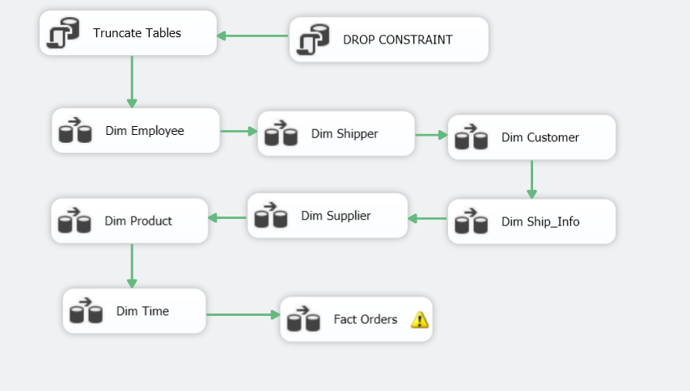
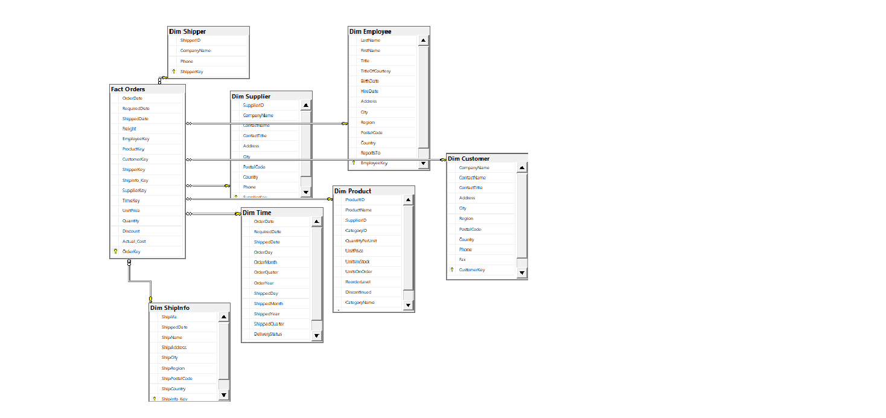

# northwind-dw-bi
Data Warehouse (Star Schema), SSIS ETL and BI Dashboard on Northwind
## Kiến trúc (Work Flow)

Extract (file .bak Northwind) → Transform (SSIS) → Load (SQL Server)
→ Star Schema → Scheduling → Visualization (Power BI)

## Mô hình dữ liệu

- Fact: `Fact Orders`
- Dimension (7): `Dim Customer`, `Dim Employee`, `Dim Product`,
  `Dim ShipInfo`, `Dim Shipper`, `Dim Supplier`, `Dim Time`

## ETL với SSIS
Toàn bộ quá trình extract, transform và load được xây dựng bằng SSIS,
không dùng script SQL viết tay. Ảnh chụp các package:

## Cách chạy
1. Khôi phục file .bak Northwind vào SQL Server
2. Tạo database `NorthWindDW` bằng `sql/01_dw_schema.sql`
3. Mở `ssis/` bằng Visual Studio, cập nhật Connection Manager, chạy các package
4. Mở file trong `dashboard/` bằng Power BI Desktop
